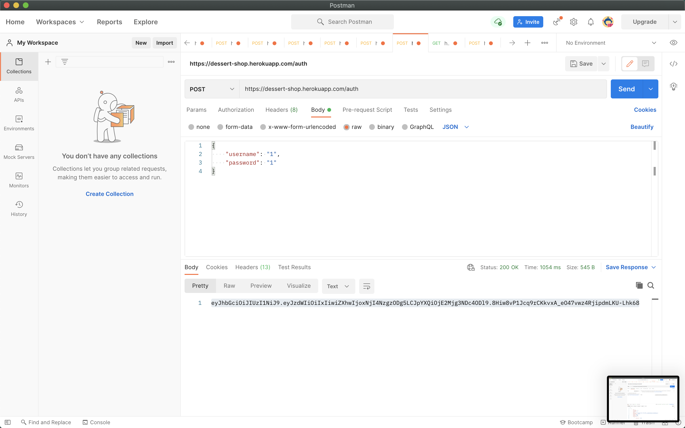
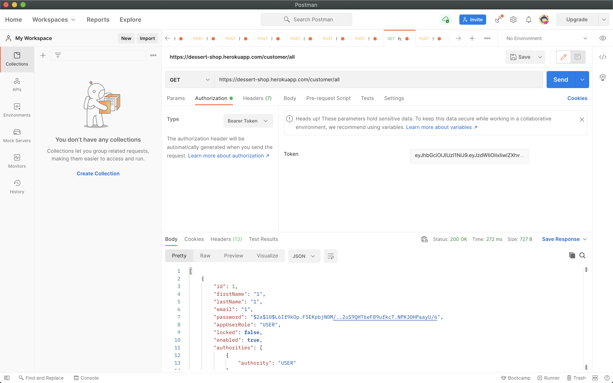
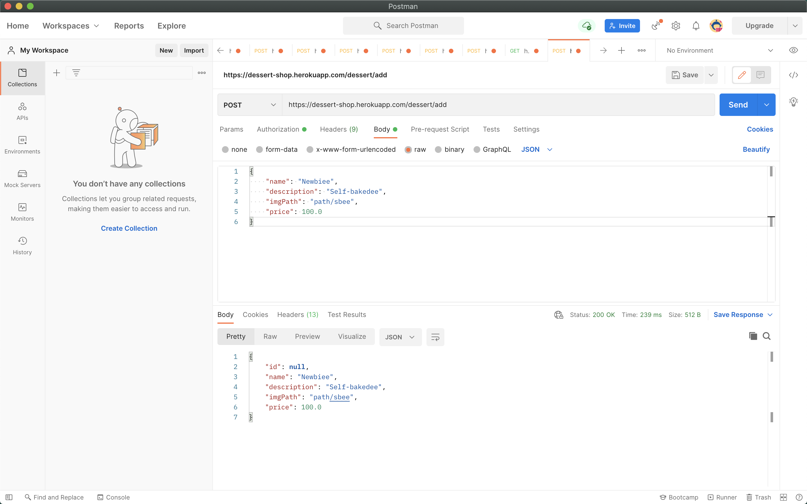
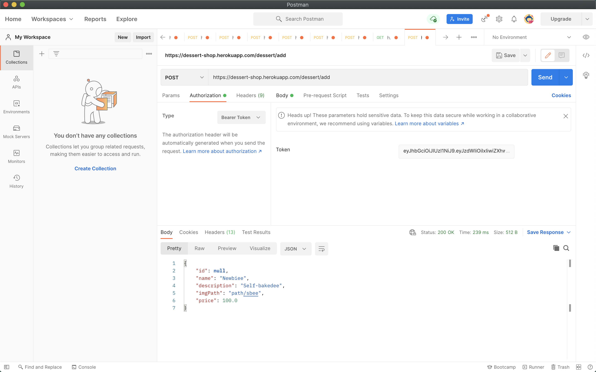

# Heroku link

<ul>
  <li><a href="https://dessert-shop.herokuapp.com">Go to page</a></li>
</ul>

### User Authentication
 
  

 
### GET (with jwt token)

  

### POST Body

  

### POST Authorization

  

